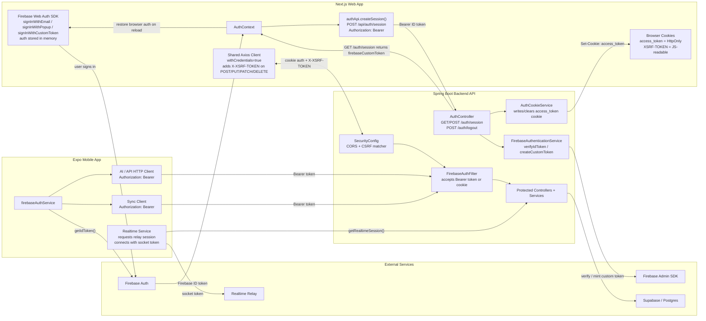
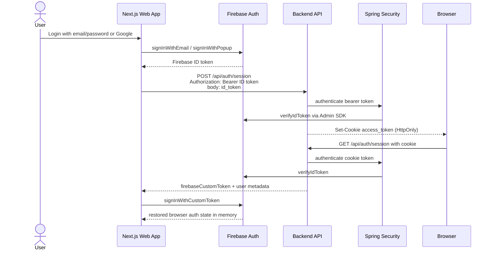
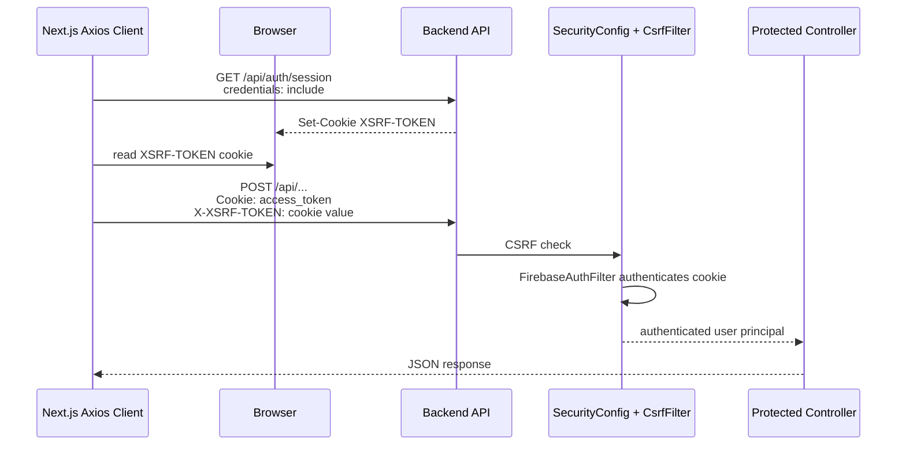
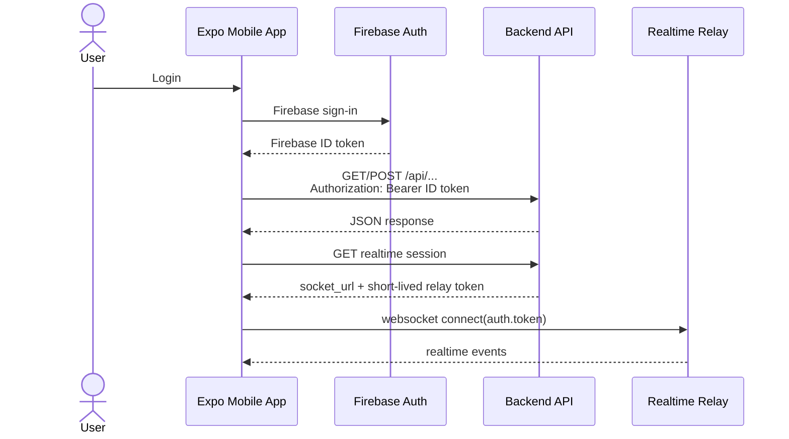

# Security Architecture

Date: 2026-03-18

## Scope

This document describes the current security architecture across the three application surfaces in this workspace:

- `expense-tracker-app-nextjs` - Next.js web app
- `expense-tracker-app` - Expo mobile app
- `backend-api-expense-springboot` - Spring Boot API

## Decision

The system uses a split authentication model:

- Web app:
  - Firebase Web Auth is used for user sign-in.
  - The web app exchanges the Firebase ID token with the backend once.
  - The backend stores web auth in an `HttpOnly` cookie.
  - Browser mutations are protected with CSRF tokens.
- Mobile app:
  - Firebase ID tokens are sent as `Authorization: Bearer <token>`.
  - Mobile does not use cookie auth or CSRF.
- Backend API:
  - Accepts either bearer-token auth or cookie auth.
  - Uses Firebase Admin verification as the trust root.

## Why this model

- Web gets stronger protection against token exfiltration by moving normal API auth out of browser-readable storage.
- Mobile remains compatible with native clients and bearer-token API patterns.
- Backend centralizes identity verification and authorization decisions.
- CSRF is enforced only where it matters: browser cookie-auth requests.

## Trust Boundaries

- Firebase Auth is the identity provider.
- Spring Boot is the authorization and API boundary.
- Browser JavaScript is treated as untrusted for long-lived secrets.
- `HttpOnly` cookies are trusted for web transport but must be protected with CSRF.
- Mobile secure storage and in-memory Firebase token handling are separate from web cookie auth.

## Component Responsibilities

- Web app:
  - Sign in with Firebase Web SDK.
  - Exchange ID token for backend cookie via `/api/auth/session`.
  - Read `XSRF-TOKEN` cookie and send `X-XSRF-TOKEN` on mutating requests.
  - Use cookie auth for normal API traffic.
- Mobile app:
  - Fetch Firebase ID token from the mobile auth layer.
  - Send bearer token on API requests.
  - Obtain short-lived realtime relay tokens from backend.
- Backend API:
  - Verify Firebase ID tokens using Firebase Admin.
  - Write and clear auth cookies for web.
  - Enforce CSRF for cookie-auth unsafe requests.
  - Authenticate protected endpoints from bearer token or cookie.

## Current Security Controls

- Web Firebase auth persistence is `inMemoryPersistence`.
- Web API client uses `withCredentials=true`.
- Web mutating requests attach `X-XSRF-TOKEN`.
- Backend auth cookie is `HttpOnly`.
- Backend applies CSRF only to unsafe requests without bearer auth.
- Backend allows bearer-token authentication for mobile and special auth-exchange requests.
- Backend CORS is credential-aware.

## Mermaid: System Overview

## Mermaid: Web Login And Cookie Flow

## Mermaid: Web CSRF-Protected Request Flow

## Mermaid: Mobile Bearer-Token Flow

## Code References

- Web auth exchange:
  - `expense-tracker-app-nextjs/lib/api/auth.api.ts`
  - `expense-tracker-app-nextjs/contexts/AuthContext.tsx`
- Web API client and CSRF:
  - `expense-tracker-app-nextjs/lib/api/http.ts`
- Backend auth and CSRF:
  - `backend-api-expense-springboot/src/main/java/com/wing/backendapiexpensespringboot/controller/AuthController.java`
  - `backend-api-expense-springboot/src/main/java/com/wing/backendapiexpensespringboot/config/SecurityConfig.java`
  - `backend-api-expense-springboot/src/main/java/com/wing/backendapiexpensespringboot/security/AuthCookieService.java`
  - `backend-api-expense-springboot/src/main/java/com/wing/backendapiexpensespringboot/security/FirebaseAuthFilter.java`
  - `backend-api-expense-springboot/src/main/java/com/wing/backendapiexpensespringboot/security/FirebaseAuthenticationService.java`
- Mobile bearer-token clients:
  - `expense-tracker-app/services/api/http.ts`
  - `expense-tracker-app/services/api/sync.api.ts`
  - `expense-tracker-app/services/realtimeService.ts`

## Current Tradeoff

The current web implementation stores the submitted Firebase ID token in the backend auth cookie after verification. This is materially better than browser-readable token storage, but it is still not the cleanest long-term web session model.

Long-term hardening path:

- replace raw ID-token cookie usage with a Firebase session cookie or an opaque backend session identifier
- add stronger production-only security headers
- keep object-level authorization checks strict on every protected resource
